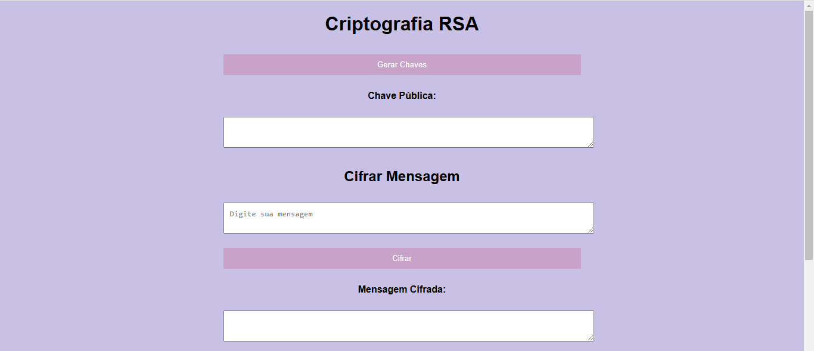
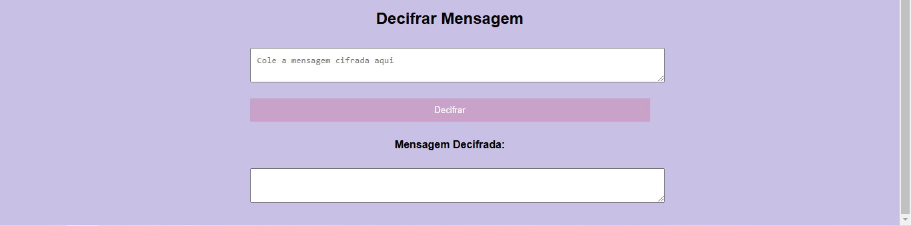

<h1 align="center">Criptografia RSA </h1>

## Project
This project involves the implementation of an asymmetric encryption system using the RSA (Rivest-Shamir-Adleman) algorithm, focusing on data security and authenticity. The system includes the generation of public and private keys, as well as functionalities for encrypting and decrypting messages. The project also includes a frontend interface in HTML, CSS, and JavaScript, allowing users to interact with the system in a simple and intuitive way, performing encryption and decryption operations directly in the browser.

## Layout
<div align="center">
  
  
</div>

## Technologies Used
- *Programming Language:* JavaScript - Backend / HTML - Frontend
- *Development Environment:* Visual Studio Code

## Code Author
```kotlin
fun main() {
    println("Code by Marcela Geremias!")
}